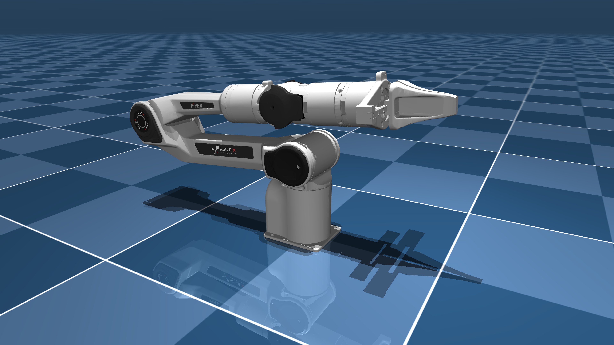

<div align="center">
  <h1>Mujoco of agilex arm</h1>
  <table>
    <tr>
      <td align="center">
        <a href="https://global.agilex.ai/products/piper">
          
        </a>
        <br />
        <sub><strong>AgileX PiPER</strong></sub>
      </td>
      <td align="center">
        <a href="https://global.agilex.ai/products/nero">
          
        </a>
        <br />
        <sub><strong>AgileX NERO</strong></sub>
      </td>
    </tr>
  </table>
  <p>
    <a href="./readme.md"><kbd>中文</kbd></a>
    <strong><kbd>English</kbd></strong>
  </p>
</div>

## 1. Project Description

This repository hosts the MuJoCo simulation workspace for the Agilex robotic arm series. It will continue to evolve as the overall project moves forward. I am also maintaining several other long-term robotics projects in parallel, so the update pace may vary, but this repository will keep being maintained and expanded with more modules over time.

## 2. Usage

### 2.1 Docker Workflow

It is recommended to build the project around the workspace `src` directory and use Docker first, because it helps avoid most dependency and environment issues. A typical setup looks like this:

```bash
mkdir agilex_ws && cd agilex_ws
git clone https://github.com/yanyuze1/agilex_ws.git
cd docker
```

Common Docker commands:

```bash
docker compose up -d --build --remove-orphans           # Build containers
docker compose up -d mujoco_agilex                      # Start the container in detached mode
docker compose ps                                       # Check container status
docker compose exec mujoco_agilex bash                  # Enter the container
docker compose down                                     # Stop and clean up containers
```

### 2.2 Build

```bash
colcon build --symlink-install
```

### 2.3 Joint Position Mode

```bash
# Launch
ros2 launch agilex_piper_mujoco bringup_mujoco_joint_position_controller.launch.py

# Publish joint targets
ros2 topic pub --once /agilex_piper_joint_position_controller/commands \
  std_msgs/msg/Float64MultiArray "{data: [0.7, 0.0, 0.0, 0.0, 0.0, 0.0]}"
```

### 2.4 Gripper Control

```bash
# Open gripper
ros2 topic pub --once /agilex_piper_gripper_position_controller/commands \
  std_msgs/msg/Float64MultiArray "{data: [0.035, -0.035]}"

# Close gripper
ros2 topic pub --once /agilex_piper_gripper_position_controller/commands \
  std_msgs/msg/Float64MultiArray "{data: [0.0, 0.0]}"
```

### 2.5 Cartesian Control Mode

```bash
# Launch
ros2 launch agilex_piper_mujoco bringup_mujoco_cartesian_motion_controller.launch.py

# Publish the end-effector target pose
ros2 topic pub --once /agilex_piper_cartesian_motion_controller/target_frame \
  geometry_msgs/msg/PoseStamped "{
    header: {frame_id: 'base_link'},
    pose: {
      position: {x: 0.2, y: 0.0, z: 0.2},
      orientation: {x: 0.0, y: 1.0, z: 0.0, w: 0.0}
    }
  }"
```

### 2.6 State Monitoring

```bash
ros2 topic echo /agilex_piper_cartesian_motion_controller/current_pose
```

## 3. Current Demo


## 4. Todo

- [x] Build the base environment with Piper arm support
- [ ] Add Agilex NERO arm support
- [ ] Add a vision module
- [ ] Replace the current controller stack
- [ ] Advance deployment testing for various VA workflows
- [ ] Advance deployment testing for various VLA workflows

## 5. Closing Notes

That is the current update for now. More content will continue to land in this repository, and more interesting features and modules will be added over time. Thanks to the open-source projects and contributors whose groundwork and ideas made this project possible.

## 6. Reference Projects

- https://github.com/renesas-rdk/agilex_piper_mujoco
- https://github.com/renesas-rdk/agilex_piper_arm_description
- https://github.com/renesas-rdk/mujoco_sim_ros2
